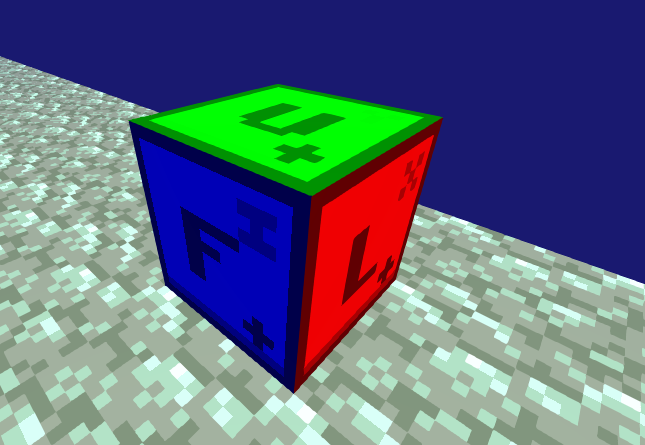
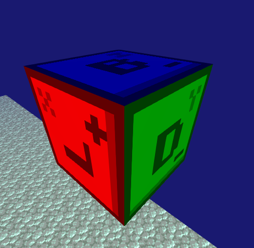

# RTT

OpenGL based 3D tile engine. The main concept is easy to edit any tile via JSON file. You can create your own tile and set to it textures, shapes, states in .json file.
Any tile can be described with any shape.

# Examples
This debug tile. It described as follows:
```json
{
  "_// 3D model of tile": [],
  "models": [ "cube.json" ],
  "_// Textures for all sides": [],
  "textures": [ "u.png", "d.png", "f.png", "b.png", "l.png", "r.png" ],
  "states": [
    {
      "_// Model index": [],
      "model": 0,
      "_// Texture layers": [],
      "layers": [ 0, 1, 2, 3, 4, 5 ],
      "transform": [ ]
    }
  ]
}
```


When "transform" contains any actions, for example "turn_x" - it means: "Turn the tile by 90 degrees around axis X"
```json
{
  "_// Any 3D transforms": [],
  "transform": [ "turn_x" ]
}
```
It looks like:


